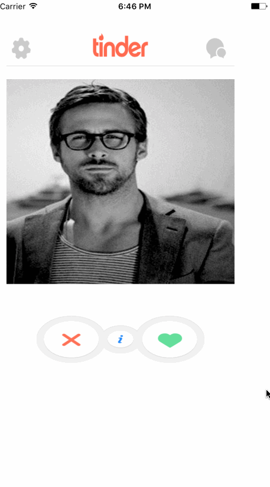

## Creating a Basic Tinder 
App (Swift)
## Tinder App IOS Codepath
## User Stories

This app has the following functionalities:

- [✔] User can swipe left and right.
- [✔] User can see the profile when clicked on the image.
- [✔] Dismiss the profile view when done is pressed.
- [✔] Retains the original location when left between left or right swipe.

Here's a walkthrough of implemented user stories:

GIF created with [LiceCap](http://www.cockos.com/licecap/).

